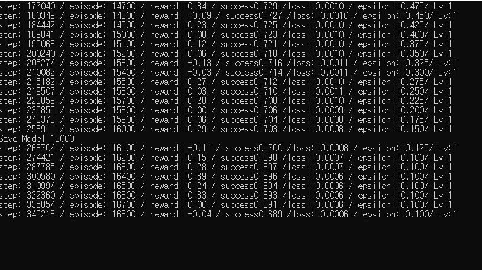

# learn-git
깃허브 배우기

깃허브 사용법을 배우기 위해 연결한 레포지토리입니다.

여러가질 배워서 나중에 잘 활용할 수 있도록 되었으면 좋겠습니다.

제목에는 #을 붙입니다.

개수에 따라 글자의 크기가 달라집니다.

가로줄을 추가하기 위해서-를 3개 이상 이어붙입니다.

--------

순서가 있는 목록은 1,2,3...번호를 붙입니다.(번호를 쓰고 .을 붙인다음 띄어쓰기)(번호가 순서대로 되어있지 않아도 목록은 순서대로 나타남)

1. 원격저장소 
3. origin 연결하기
2. push
4. pull하거나 내용을 확인하기 위해 fetch하기
5. 협업하기

순서가 없는 목록은 +,-,* 중 하나를 골라 붙입니다.

- 원격저장소
- origin
- push
- pull
- 작업

들여쓰기를 위해 tab을 활용합니다.

  - 원격 저장소
    - 가 저장소
    - 나 저장소
    - 다 저장소
  - push
  - fetch
    - 또는 pull

텍스트를 강조할 수 있습니다.

- 굵게
  - 텍스트의 앞 뒤를 ** 이나 __ 로 감쌉니다.
  - 테스트 -> **테스트**
- 기울림체
  - 텍스트의 앞 뒤를 * 또는 __ 로 감쌉니다.
  - 테스트 -> *테스트*
- 굵은 기울임체
  - 텍스트의 앞 뒤를 *** 또는 ___ 로 감쌉니다.
  - 테스트 -> ***테스트***
- 취소선
  - 텍스트의 앞 뒤를 ~~ 로 감쌉니다.
  - 테스트 -> ~~테스트~~

인용문을 삽입할 수 있습니다.

- 첫 번째 줄의 맨 앞에 >를 추가합니다. 인용문 안에 또 다른 인용문을 삽입하기 위해서 >>를 추가합니다.

> the information manager from hell
>> git means "global information tracker"

텍스트 사이에 소스 코드를 삽입할 수 있습니다.

- 소스 코드의 삽입을 위해서 ` `를 활용합니다.
- 다음 코드를 살펴봅시다. `print(git)`
- 여러줄의 코드를 삽입하고 싶다면 ``` ```를 활용합니다. 뒤에 javascript나 python등의 언어를 표시하면 해당 언어에 맞는 소스 형태로 변환됩니다.

```python
print(hello)
for model in models:
  print(model[0])
print(done)
```

링크를 삽입할 수 있습니다.
- <링크주소>
- [링크 텍스트](링크주소)
- [링크](주소, "검색 사이트")

이미지를 삽입할 수 있습니다.
- 마크 다운에서 이미지를 삽입할 때는 맨 앞에 !를 붙인 후 대체 텍스트와 이미지 파일 경로를 지정합니다. 이미지 파일이 경로를 가지기 위해서는 웹에 올라와 있어야 하며 자신이 운영하는 웹사이트에 이미지를 올린 후에 그 경로로 가져와서 사용하면 됩니다.


이미지 파일을 깃허브 저장소에 직접 올린 다음에 그 경로를 README 파일에서 지정해도 됩니다.

